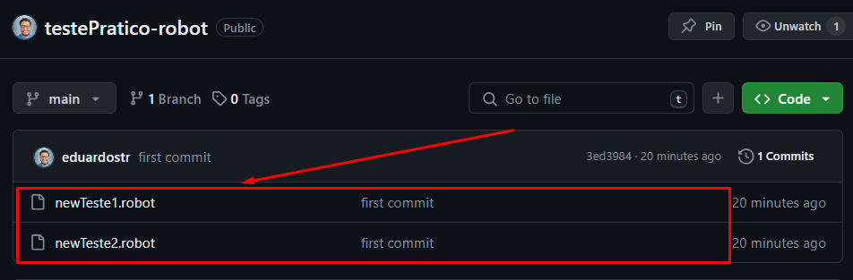
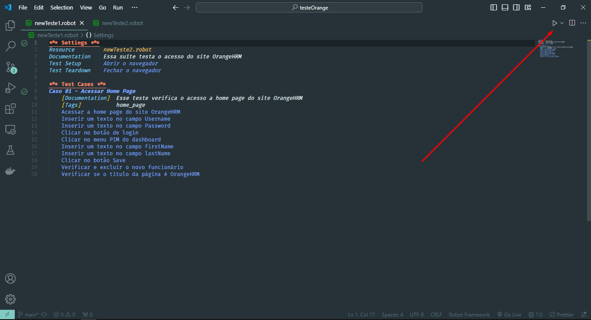
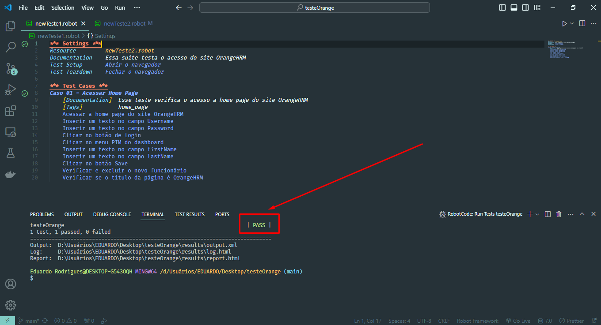

### Para rodar o teste é necessário criar 2 arquivos com a extensão .robot, ficando desta forma:

newTeste1.robot

newTeste2.robot

### Após criar os arquivos em alguma IDE (de preferência o VS Code), cole os códigos que estarão disponíveis em meu repositório desta forma:

### Após colar os códigos em seus respectivos arquivos, clique no arquivo "newTeste1.robot" e em seguida clique no ícone de play no canto superior direito do VS Code para rodar o script de teste, desta forma:

### Por fim, ao finalizar o teste, será exibido várias mensagens no terminal integrado do VS Code, porém será exibido o nome "PASS" o que indica que o teste passou, ficando desta forma:

### Confira abaixo o gif do teste por completo:
